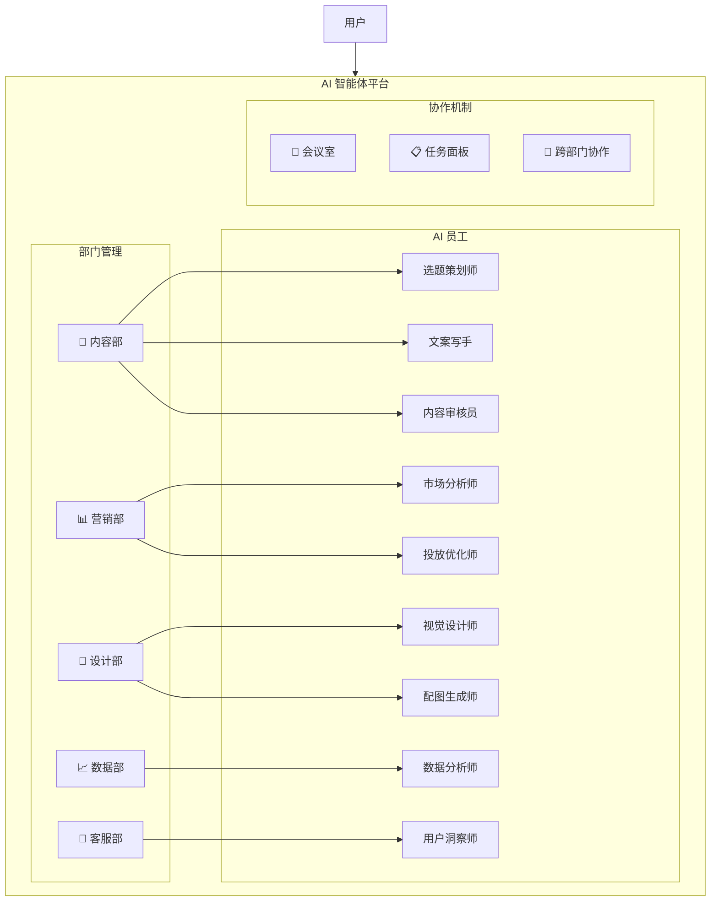
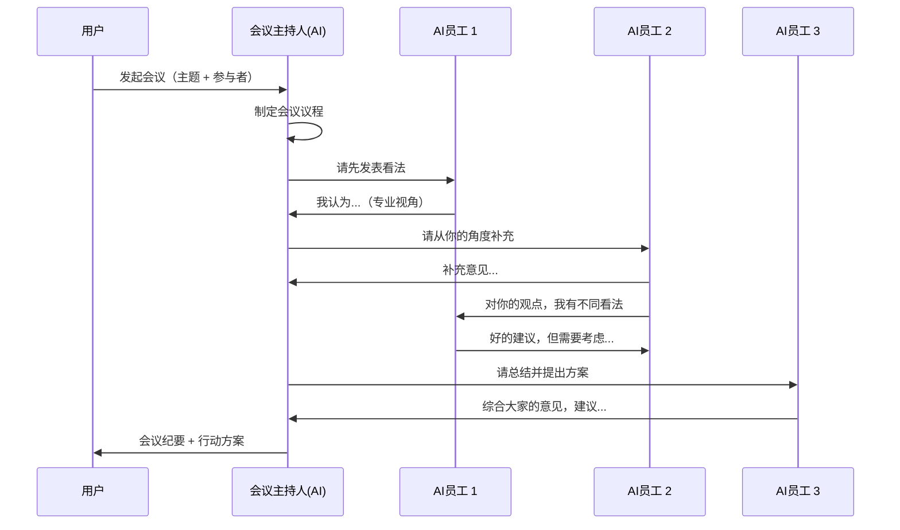

# 多部门 AI 智能体平台 — 系统设计方案

## 🎯 设计目标

将 ContentFlow 从「单一内容创作工具」升级为**企业级多部门 AI 智能体协作平台**，实现：
- 多个部门，每个部门包含多名 AI 员工
- AI 员工可以**开会讨论**、**跨部门协作**
- 用户可以**下达任务**给部门或个人
- 实时展示 AI 员工的思考和讨论过程

---

## 🏗️ 整体架构



---

## 📁 部门与 AI 员工设计

### 1. 内容部 — Content Department

| AI 员工 | 角色 | 核心能力 |
|---------|------|---------|
| **选题策划师** | Topic Planner | 热点追踪、选题策划、流量预测 |
| **文案写手** | Copywriter | 多平台文案创作（抖音/视频号/小红书） |
| **内容审核员** | Content Reviewer | 质量评分、合规检查、优化建议 |
| **模仿创作师** | Style Imitator | 分析爆款风格、模仿创作 |

### 2. 营销部 — Marketing Department

| AI 员工 | 角色 | 核心能力 |
|---------|------|---------|
| **市场分析师** | Market Analyst | 竞品分析、趋势洞察、用户画像 |
| **投放优化师** | Ad Optimizer | 广告策略、投放优化、ROI分析 |
| **增长黑客** | Growth Hacker | 裂变策略、私域运营、粉丝增长 |

### 3. 设计部 — Design Department

| AI 员工 | 角色 | 核心能力 |
|---------|------|---------|
| **视觉设计师** | Visual Designer | 配色方案、排版建议、品牌一致性 |
| **配图生成师** | Image Generator | AI配图、封面设计、海报制作 |
| **视频脚本师** | Video Scripter | 分镜设计、转场建议、BGM推荐 |

### 4. 数据部 — Data Department

| AI 员工 | 角色 | 核心能力 |
|---------|------|---------|
| **数据分析师** | Data Analyst | 内容数据分析、用户行为分析 |
| **SEO 优化师** | SEO Specialist | 关键词优化、搜索排名策略 |

### 5. 客服部 — Service Department

| AI 员工 | 角色 | 核心能力 |
|---------|------|---------|
| **用户洞察师** | User Insight | 用户反馈分析、需求挖掘 |
| **知识库管理** | Knowledge Manager | 品牌知识库维护、FAQ更新 |

---

## 💬 会议系统设计

### 会议类型

| 会议类型 | 说明 | 示例场景 |
|---------|------|---------|
| **部门内会议** | 同部门 AI 员工讨论 | 内容部讨论本周选题方向 |
| **跨部门会议** | 多部门 AI 员工协作 | 内容部 + 营销部讨论推广策略 |
| **项目会议** | 围绕特定任务的讨论 | 新品上市的全案策划 |
| **复盘会议** | 对已完成任务进行复盘 | 上周爆款内容的数据复盘 |

### 会议流程



### 会议 UI 界面

- **左侧**：参与者列表（头像 + 姓名 + 部门标签）
- **中间**：实时对话流（类似群聊，每条消息带 AI 员工头像和思考过程）
- **右侧**：会议纪要面板（自动生成的要点和行动项）
- **底部**：用户输入区（可随时向会议中提问或补充信息）

---

## 🖥️ UI 页面设计

### 页面结构

```
/                     → 仪表盘（各部门状态概览）
/departments          → 部门管理（所有部门和员工）
/department/[id]      → 部门详情（部门内员工 + 历史任务）
/agent/[id]           → 员工详情（能力、历史、对话）
/meeting              → 会议列表
/meeting/[id]         → 会议室（实时讨论）
/tasks                → 任务面板
/workspace            → 创作工作区（保留现有）
```

### 侧边栏改版

```
ContentFlow
├── 🏠 仪表盘
├── 📋 任务中心
│   ├── + 新建任务
│   └── 进行中的任务
├── 💬 会议室
│   ├── 发起会议
│   └── 历史会议
├── ── 部门管理 ──
├── 📝 内容部 (4人)
│   ├── 🟢 选题策划师
│   ├── 🟢 文案写手
│   ├── 🟡 内容审核员
│   └── 🔵 模仿创作师
├── 📊 营销部 (3人)
│   ├── 🟢 市场分析师
│   ├── 🟡 投放优化师
│   └── 🔵 增长黑客
├── 🎨 设计部 (3人)
├── 📈 数据部 (2人)
├── 🤝 客服部 (2人)
├── ── 工具 ──
├── ✏️ 创作工作区
├── 👤 个人中心
└── ⚙️ 系统设置
```

---

## 🔧 技术实现方案

### 1. 数据模型

```typescript
// 部门
interface Department {
  id: string;
  name: string;
  icon: string;
  description: string;
  agents: AgentProfile[];
  color: string; // 部门主题色
}

// AI 员工档案
interface AgentProfile {
  id: string;
  name: string;
  avatar: string;        // 头像URL或生成的头像
  departmentId: string;
  role: string;           // 职位名称
  personality: string;    // 人设性格描述
  systemPrompt: string;   // 底层系统提示
  capabilities: string[];
  status: 'online' | 'busy' | 'offline';
  stats: {
    tasksCompleted: number;
    meetingsAttended: number;
    avgScore: number;
  };
}

// 会议
interface Meeting {
  id: string;
  title: string;
  topic: string;
  type: 'department' | 'cross-department' | 'project' | 'review';
  participants: AgentProfile[];
  messages: MeetingMessage[];
  summary?: MeetingSummary;
  status: 'active' | 'completed';
  createdAt: string;
  createdBy: string; // 用户ID
}

// 会议消息
interface MeetingMessage {
  id: string;
  agentId: string;
  agentName: string;
  content: string;
  thinking?: string;    // AI 的思考过程（可展开）
  replyTo?: string;     // 回复哪条消息
  timestamp: number;
  type: 'opinion' | 'question' | 'suggestion' | 'summary' | 'user_input';
}

// 会议纪要
interface MeetingSummary {
  keyPoints: string[];
  decisions: string[];
  actionItems: {
    assignee: string;    // Agent ID
    task: string;
    deadline?: string;
  }[];
  nextSteps: string[];
}

// 任务
interface AgentTask {
  id: string;
  title: string;
  description: string;
  assignedDepartment?: string;
  assignedAgents: string[];
  status: 'pending' | 'in_meeting' | 'in_progress' | 'review' | 'done';
  meetingId?: string;    // 关联的会议
  result?: unknown;
  createdAt: string;
}
```

### 2. 会议引擎核心逻辑

```typescript
// meeting-engine.ts — 控制AI员工讨论的核心引擎
class MeetingEngine {
  // 发起会议
  async startMeeting(topic: string, participants: AgentProfile[]): AsyncGenerator<MeetingMessage> {
    // 1. 主持人开场
    yield this.moderatorOpening(topic, participants);
    
    // 2. 轮流发言 — 每个参与者基于上下文给出观点
    for (const agent of participants) {
      const context = this.buildContext(topic, previousMessages);
      const response = await this.callAgent(agent, context);
      yield response;
    }
    
    // 3. 自由讨论 — AI员工互相回应
    for (let round = 0; round < MAX_ROUNDS; round++) {
      const nextSpeaker = this.selectNextSpeaker(previousMessages);
      const response = await this.callAgent(nextSpeaker, context);
      yield response;
      
      if (this.isConsensus(previousMessages)) break;
    }
    
    // 4. 总结
    yield this.generateSummary(previousMessages);
  }
}
```

### 3. 新增 API 路由

```
POST /api/departments          → 获取所有部门
POST /api/meeting/start        → 发起会议（SSE 流式）
POST /api/meeting/message      → 用户向会议中发消息
GET  /api/meeting/[id]         → 获取会议记录
POST /api/tasks/create         → 创建任务
POST /api/tasks/assign         → 分配任务给部门/员工
```

### 4. 开发分期

| 阶段 | 内容 | 预估工作量 |
|------|------|-----------|
| **Phase 1** | 部门 & 员工管理 + 侧边栏改版 | 1-2天 |
| **Phase 2** | 会议系统（核心引擎 + 基础UI） | 2-3天 |
| **Phase 3** | 任务面板 + 跨部门协作 | 1-2天 |
| **Phase 4** | 仪表盘 + 数据统计 + 打磨 | 1-2天 |

---

## 🎨 设计理念

1. **拟人化**：每个 AI 员工有独特的名字、头像、性格，让体验更生动
2. **透明性**：展示 AI 的思考过程，让用户理解决策逻辑
3. **可控性**：用户可以随时介入会议、调整方向、指定参与者
4. **渐进式**：保留现有创作工作区，新功能作为增强叠加
